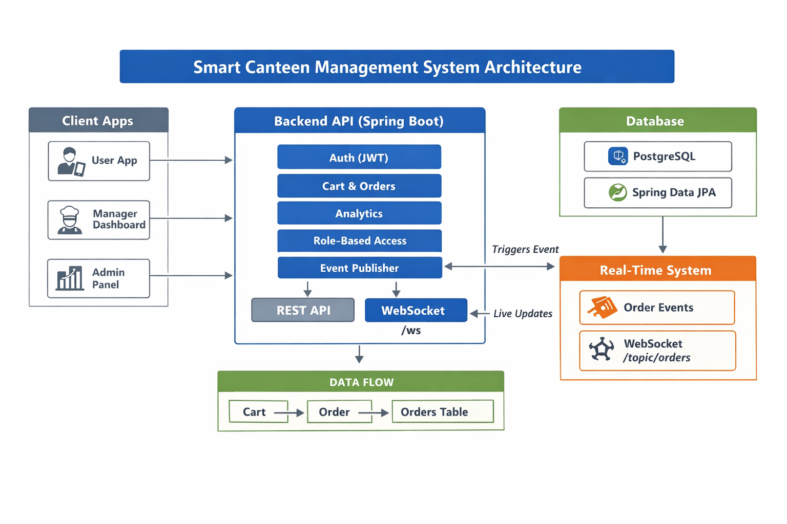

# 🍽️ Smart Canteen Management System (Backend)


🚀 A production-ready backend system for a **Smart Canteen** that enables real-time order processing, role-based management, and advanced analytics.

---

## 🏗️ System Architecture

📌 This diagram illustrates the complete backend architecture including real-time event-driven communication.



---


## 🎥 Project Preview

* 🛒 Cart & Checkout Flow
* ⚡ Real-time Kitchen Dashboard
* 📊 Analytics Dashboard

> Frontend integration in progress

---

## 🔥 Key Features

* ⚡ Real-time order updates using WebSockets
* 🛒 Cart-based checkout system (industry-standard flow)
* 🔐 JWT Authentication & Role-based access control
* 📊 Advanced analytics (daily, weekly, monthly revenue)
* 👨‍🍳 Kitchen dashboard support (live order stream)
* 🧠 Clean architecture & scalable design

---

## 🏗️ Tech Stack

| Layer      | Technology                  |
| ---------- | --------------------------- |
| Backend    | Spring Boot                 |
| Language   | Java 17                     |
| Database   | PostgreSQL                  |
| Security   | Spring Security + JWT       |
| ORM        | Spring Data JPA (Hibernate) |
| Realtime   | WebSocket (STOMP)           |
| Build Tool | Maven                       |

---

## 📁 Project Structure

```
src/main/java/com/smartcanteen/backend
│
├── config/         # Security, WebSocket, CORS
├── controller/     # REST APIs
├── service/        # Business logic
├── repository/     # Database layer
├── dto/            # Request/Response models
├── entity/         # JPA entities
├── exception/      # Custom exceptions
└── websocket/      # Real-time events
```

---

## 🔁 Real-World Order Flow

1. User adds items to cart
2. User clicks checkout
3. Order is created in backend
4. Event is published
5. Kitchen dashboard receives order in real-time
6. Manager updates status
7. User sees live updates

---

## 🛒 API Overview

### 🔐 Authentication

```
POST /users/register
POST /users/login
```

---

### 🛒 Cart

```
POST /cart/add
GET /cart
PUT /cart/item/{id}
DELETE /cart/item/{id}
POST /cart/checkout
```

---

### 📦 Orders

```
GET /orders/my-orders
GET /orders
PUT /manager/orders/{id}/status
```

---

### 📊 Analytics

```
GET /analytics/revenue/daily
GET /analytics/revenue/weekly
GET /analytics/revenue/monthly
GET /analytics/orders/status
GET /analytics/top-items
GET /analytics/category-sales
```

---

## ⚡ Real-Time System

> Orders appear instantly on the kitchen screen without refresh.

### Flow:

```
User Checkout → Order Created → Event Triggered → WebSocket → Manager Screen Updated
```

### WebSocket:

* Endpoint: `/ws`
* Topic: `/topic/orders`

---

## 📦 Sample API Response

### Place Order

```json
{
  "success": true,
  "message": "Order placed successfully",
  "data": {
    "id": 101,
    "status": "PENDING",
    "totalAmount": 250
  }
}
```

---

## 🔐 Authentication

All protected routes require:

```
Authorization: Bearer <JWT_TOKEN>
```

---

## 🗄️ Database Design

Core entities:

* Users
* Cart & CartItems
* Orders & OrderItems
* FoodItems

---

## 🧪 How to Run Locally

```
git clone https://github.com/your-username/smart-canteen-backend.git
cd smart-canteen-backend
mvn spring-boot:run
```

---

## ⚙️ Configuration

Update `application.properties`:

```
spring.datasource.url=your_db_url
spring.datasource.username=your_user
spring.datasource.password=your_password
```

---

## 💡 Why This Project?

This project simulates a real-world canteen system with:

* Cart-based ordering (like Swiggy/Zomato)
* Real-time kitchen updates
* Role-based system (User, Manager, Admin)
* Analytics for business insights

Designed to demonstrate **production-level backend development**.

---

## 🧠 Engineering Decisions

* Used cart-based checkout instead of direct order API
* Implemented event-driven architecture for real-time updates
* Used DTO projection for efficient analytics queries
* Enforced role-based security using Spring Security

---

## 👨‍💻 Author

**Dhruv Singh**

---

## ⭐ Support

If you like this project, give it a ⭐ on GitHub!
