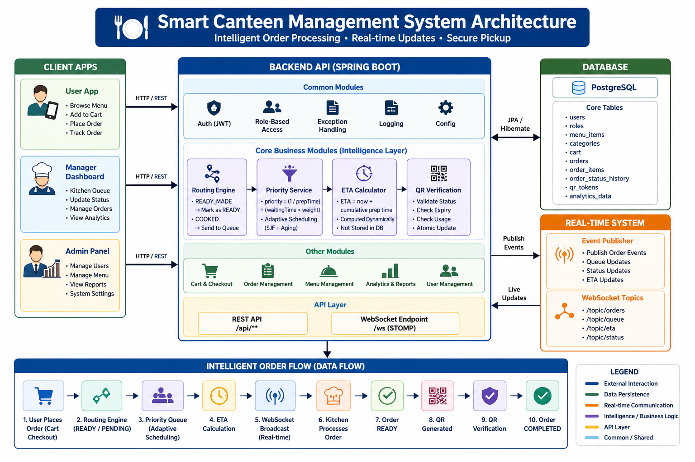

# 🍽️ Smart Canteen Management System (Backend)

🚀 A real-time smart canteen backend system built as a college project to simulate how modern food-ordering platforms (like Swiggy/Zomato) handle order flow, scheduling, and secure pickup.

---

## 🏗️ System Architecture

📌 This diagram illustrates the complete backend architecture including real-time event-driven communication.  

---

## 🎯 Impact

- Reduces wait time for small orders using priority scheduling  
- Provides real-time visibility to kitchen and users  
- Prevents duplicate pickup using secure QR validation  
- Simulates real-world backend workflows beyond CRUD  

---

## 🧠 Core Concepts

- Smart routing (ready-made vs cooked)
- Adaptive priority scheduling (SJF + aging inspired)
- Dynamic ETA calculation
- Secure QR-based pickup
- Real-time updates using WebSocket

---

## ⚙️ Intelligent Order Flow

User Places Order
→ Routing Engine (READY / PENDING)
→ Priority Queue
→ ETA Calculation
→ WebSocket Broadcast
→ Kitchen Dashboard
→ Order READY
→ QR Generated
→ QR Verification
→ Order COMPLETED

---

## 🔀 Smart Routing Engine

- READY_MADE items → directly marked READY  
- COOKED items → sent to kitchen queue (PENDING)  

---

## 📊 Priority Scheduling

priority = (1 / prepTime) + (waitingTime × weight)

- Faster orders complete quickly  
- Older orders gradually increase priority  
- Prevents starvation  

---

## ⏱️ ETA Prediction

ETA = current time + cumulative prep time of active queue

- Not stored in DB  
- Computed dynamically  
- Reflects real-time workload  

---

## 🔐 Secure QR Pickup

QR Scan
→ POST /orders/verify
→ Validate (status, expiry, usage)
→ Atomic DB Update
→ Order COMPLETED

- Single-use QR  
- Expiry validation  
- Prevents race conditions  

---

## 🔥 Key Features

- JWT-based authentication  
- Role-based access control  
- Cart-based checkout system  
- Smart routing system  
- Priority-based scheduling  
- Dynamic ETA calculation  
- WebSocket real-time updates  
- Secure QR verification  
- Analytics endpoints  

---

## 🏗️ Tech Stack

| Layer      | Technology                  |
|------------|----------------------------|
| Language   | Java 17                    |
| Backend    | Spring Boot                |
| Security   | Spring Security + JWT      |
| Database   | PostgreSQL                 |
| ORM        | JPA / Hibernate            |
| Realtime   | WebSocket (STOMP)          |
| Build Tool | Maven                      |

---

## 📁 Project Structure

controller/
service/
repository/
entity/
dto/
websocket/
security/

---

## 🧪 How to Run

1. Clone the repo   
git clone https://github.com/your-username/smart-canteen-backend.git
cd smart-canteen-backend

2. Configure database
spring.datasource.url=jdbc:postgresql://localhost:5432/smart_canteen
spring.datasource.username=your_username
spring.datasource.password=your_password

3. Run project
mvn spring-boot:run

---

## 🧪 API Testing (Postman)

### Authentication
- POST /users/register  
- POST /users/login  

### Cart
- POST /cart/add  
- GET /cart  
- POST /cart/checkout  

### Orders
- GET /orders  
- PUT /manager/orders/{id}/status  

### QR Verification
- POST /orders/verify  

---

## 👨‍💻 My Contribution

- Designed full backend architecture  
- Implemented routing and scheduling logic  
- Built priority queue behavior  
- Developed ETA computation system  
- Integrated WebSocket real-time updates  
- Implemented secure QR verification with atomic handling  
- Structured backend using layered architecture  

---

## 🧠 What I Learned

- Designing backend systems beyond CRUD  
- Queue prioritization and scheduling logic  
- Real-time system design using WebSocket  
- Handling race conditions safely  
- Building secure verification flows  
- Structuring scalable backend applications  

---

## 💡 Future Improvements

- Multi-station kitchen routing  
- Load-based balancing  
- Redis-based queue optimization  
- Notification system  
- Payment gateway integration  
- Docker deployment  

---

## 👨‍💻 Author

Dhruv Singh  

---

## ⭐ Final Note

This is a project built with a focus on **real-world backend behavior**:
